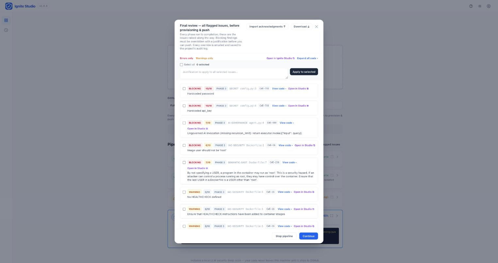

# Ignite — Onboarding Gatekeeper

[](LICENSE)

A single-page web app that acts as a compliance gate for onboarding code into a GitHub organization. Users upload a project as a ZIP; the server scans it locally for security and AI-framework violations, and only if **every** check passes does it provision a private GitHub repository and push the code. There's also a [pre-push git hook](#pre-push-hook) (`hooks/pre-push`) for repos that would rather gate on `git push` than a separate upload step.

**Most of the detection below is deterministic static analysis by dedicated tools — Semgrep (SAST), deps.dev/OSV (CVE), Trivy/Checkov/hadolint (IaC), GuardDog (supply-chain), gitleaks (secrets), cosign, Bearer, Spectral — not an LLM guessing.** The local LLM deep-scan is one additional, independently-toggleable layer (`LLM_DEEP_SCAN_ENABLED`) for logic-level review that fixed rule sets can't reach; every static engine below runs identically whether it's on or off. See the [attack & risk coverage table](#attack--risk-coverage--what-each-check-actually-prevents) for the full tool-by-tool mapping.

📖 **[See it in action — screenshots & walkthrough](https://nunomcpereira.github.io/ignite/)**

<p align="center">
  
</p>

## System Architecture

```
┌──────────────┐  multipart POST   ┌─────────────────────────────────────────┐
│   Browser    │ ───────────────▶  │  Express server (server.js)             │
│  (index.html)│                   │                                         │
│              │ ◀───────────────  │  1. multer buffers ZIP →                │
│  NDJSON      │  streamed events  │     $TMPDIR/gatekeeper-uploads/<rand>   │
│  pipeline UI │  (log / status /  │  2. safe-extract (zip-slip + bomb       │
└──────────────┘   done)           │     guards) →                           │
                                   │     $TMPDIR/gatekeeper-staging/<uuid>/  │
                                   │  3. Check 1: deny .env* files           │
                                   │  4. Check 2: secret regex scan          │
                                   │  5. Check 4: AI governance audit        │
                                   │  6. Phase 4 (only if all green):        │
                                   │     git init/add/commit,                │
                                   │     gh repo create --private,           │
                                   │     git remote add + push               │
                                   │  7. finally: rm -rf staging dir AND     │
                                   │     uploaded ZIP — success or failure   │
                                   └─────────────────────────────────────────┘
```

**File lifecycle:** upload → temp ZIP (multer) → extracted staging directory (per-job UUID, isolated under the OS temp dir) → scanned in place → pushed from staging → **forcefully deleted in a `finally` block**, so no user code lingers on disk regardless of outcome.

**Progress transport:** the pipeline endpoint keeps the POST response open and streams newline-delimited JSON events (`log`, `status`, `done`). The frontend consumes the stream with `fetch` + `ReadableStream` and re-renders the stepper in real time — no WebSocket or polling needed.

## Pipeline Checks

Six phases, run in order. Phases 1, 3, and 6 always run — everything downstream depends on them. Phases 2, 4, and 5 can be turned on/off in `config.json` (see [Configurable phases](#configurable-phases--gxp) below); a disabled phase is hidden from the UI entirely and never checked, not just skipped.

Phase 4's displayed name drops to **"Security & Compliance Scan"** (from "Security & AI Compliance Scan") whenever the LLM deep-scan endpoint isn't reachable — every other Phase 4 check still runs exactly the same, only the LLM sub-check is skipped, so the name shouldn't claim an AI check ran when it didn't. `GET /api/config` health-probes the endpoint (cached 15s) and swaps the title only if it's still the unmodified default — a title already customized via `config.json`'s `phases` override is left untouched either way.

| Phase | Check | Failure condition | Configurable? |
|---|---|---|---|
| 1 | Input & metadata | Invalid org/repo name, missing GitHub auth | Always on |
| 2 | GxP validation documents | GxP declared but no validation document (upload or link) attached | **Off by default** — see [GxP](#configurable-phases--gxp) |
| 3 | Structure audit | Any file named `.env` or `.env.*` anywhere in the tree | Always on |
| 3 | License compliance | A dependency manifest declares a package with a commercial/proprietary/unrecognized license (red = blocking error, copyleft = warning), or a `LICENSE`/`LICENCE` file anywhere in the tree contains commercial/proprietary terms (e.g. a `Licensee:` grant). Runs first inside Phase 3, before the throwing checks, so findings survive a failed structure audit. See [Dependency & license compliance](#dependency--license-compliance-ort--licensee--depsdev). | Always on |
| 3 | Unit tests | The project's native test suite (Node/Go/Rust/Python/Java, auto-detected) fails in an isolated Docker container | Always on |
| 4 | Secret leakage | Line matches `/(password\|aws_secret\|api_key\|token\|private_key)\s*[:=]\s*['" \t]*[a-zA-Z0-9_\-.~]{10,}/i` in any text file (binaries, `node_modules`, `.git`, etc. excluded). Optionally supplemented by [gitleaks](#gitleaks) — see below. | On/off |
| 4 | AI governance | A `.py`/`.js`/`.ts` file calls `.invoke(` / `.stream(` / `.ainvoke(` / `.astream(` but never mentions `recursion_limit` | On/off |
| 4 | LLM deep-scan | A local LLM reports critical/high vulnerabilities **and** `LLM_SCAN_MODE=block`; otherwise findings are advisory (amber). Skipped softly if the endpoint is down. | On/off |
| 4 | IaC/container misconfiguration | Trivy (primary) flags a Dockerfile/Terraform/Kubernetes/Helm misconfiguration, optionally supplemented by Checkov and hadolint. Falls back to a small built-in Dockerfile heuristic (unpinned base image, missing `USER`) when Trivy isn't installed. See [External tools](#external-tools). | On/off (per sub-tool) |
| 4 | Base-image signature/provenance | Cosign reports a Dockerfile `FROM` base image with no verifiable Sigstore signature. Advisory only — never blocks a run on its own. **On by default** (makes a real network call per image — `COSIGN_ENABLED=false` to opt out). | On/off |
| 4 | Semantic SAST | Semgrep (OSS rulesets) flags a logical flaw or injection-style sink beyond what the LLM deep-scan catches. | On/off |
| 4 | PII/GDPR data-flow | Bearer traces personal data (request params, user objects) reaching a sink (logs, DB writes, 3rd-party calls) — only findings Bearer itself tags as PII/Personal-Data-relevant; its broader generic-security findings (path traversal, weak crypto, ...) are filtered out rather than mislabeled as PII, since Semgrep already covers that ground. **On by default** — needs a git context, which Ignite stages automatically. | On/off |
| 4 | Code duplication | jscpd flags a duplicated code block above its default threshold. Always advisory (warning), never blocking. **Off by default.** | Off by default |
| 4 | API schema lint | Spectral lints every discovered OpenAPI/AsyncAPI file (found by content, not filename) against its bundled ruleset (`spectral:oas` + `spectral:asyncapi` by default). | On/off |
| 4 | Malicious dependency | GuardDog flags a supply-chain-attack pattern (install-script exfiltration, obfuscated payload, silent network call, typosquatting) in an npm/PyPI dependency, independent of whether a CVE has been published. **On by default** (downloads and inspects every dependency's real package contents — slower/heavier than the rest of Phase 4; set `GUARDDOG_ENABLED=false` to opt out). | On/off |
| 5 | Org governance CI (act) | Any job of the central `ai-guardrails-orchestrator.yml` fails when executed locally in Docker. Soft-skipped if `act`/Docker are unavailable. | On/off |
| 6 | Shipping | Any `git`/`gh` command exits non-zero | Always on (`dryRun` is the "don't ship" switch, not a phase toggle) |

Three Phase 4 sub-steps are purely descriptive and never produce a flagged issue: Syft generates a CycloneDX SBOM, gocloc computes per-language LOC counts, and the **Compliance & Feature Posture Engine** classifies whether the codebase shows SSO/SAML/OIDC, RBAC/ABAC, audit logging, SIEM log forwarding, HTTPS/TLS enforcement, backups/DR, encryption at rest, and rate limiting as `DETECTED` (confirmed usage found), `PARTIAL` (only an import/dependency reference found), or `MISSING`, per category — via a custom Semgrep ruleset (`ignite-posture-rules.yaml`) when Semgrep is connected, or a built-in regex posture scanner (narrower coverage, same weak/strong model) when it isn't; logged as `Engine: Semgrep CLI vX.X (External Posture Scanner)` / `Engine: Ignite Built-In Posture Scanner (Fallback)`. All three are on by default and, when they run, attach their output as a downloadable JSON document on the project (same place GxP validation documents show up), rather than gating anything.

### Configurable phases + GxP

`config.json`'s optional `phases` array overrides any phase's title, description, or `enabled` state by `id` — anything not listed keeps its built-in default:

```jsonc
"phases": [
  { "id": 2, "enabled": true },                                     // turn GxP on
  { "id": 5, "enabled": false, "title": "Org Governance CI (off)" }  // turn a phase off + relabel it
]
```

- **Phase 2 (GxP) defaults to disabled** — most orgs onboarding through Ignite aren't running a GxP-regulated process, so the "Is this a GxP-regulated process?" question and mandatory validation-document upload are hidden from the UI until explicitly enabled. A client that sends `gxp: true` while Phase 2 is disabled is ignored server-side too — disabling it is a real "not checked", not just a UI hide.
- **Phases 1, 3, and 6 can't be disabled** — Phase 3 stages the project every later phase scans/ships, Phase 1 creates the project record, and Phase 6 is the pipeline's actual purpose (`dryRun` is how you skip shipping without disabling a phase). An `enabled: false` override on these ids is silently ignored.
- Title/description overrides apply everywhere the phase is named: the UI timeline, `GET /api/config`, and failure emails.

### Phase 5 — running the org's GitHub Actions locally

Instead of replicating the logic of the centrally defined governance workflows, Phase 5 executes the **real** workflow files with [`act`](https://github.com/nektos/act):

1. The orchestrator (`ai-guardrails-orchestrator.yml`) is fetched fresh from `ai-governance-poc-2026/devops-governance@main` via `gh api` and cached outside the project tree (never committed/pushed).
2. `act pull_request -W <orchestrator>` runs it against the staged project in Docker (`catthehacker/ubuntu:act-latest` runner image). The reusable sub-workflows it `uses:` (node/python/java/rust/go/ai-agent/security pipelines) are resolved from GitHub at run time — exactly as they would be in a real PR, so local results match the remote gate.
3. Any failing job halts the pipeline before anything reaches GitHub.

Requires `brew install act` and a running Docker daemon; if either is missing the phase soft-skips with a warning (the workflows still gate the repo remotely). Configure with `GOVERNANCE_REPO`, `GOVERNANCE_WORKFLOW`, `ACT_EVENT`, `ACT_TIMEOUT_MIN`.

A failed check halts the pipeline, reports offending file paths and line numbers in the phase's terminal widget, marks downstream phases **Skipped**, and cleans up staging.

## External tools

Ignite integrates with fourteen optional external tools (plus a fifteenth compliance-posture check that reuses Semgrep rather than adding its own binary) across dependency/license, secret, IaC/container, supply-chain, SAST, code-metrics, API-schema, and compliance-posture scanning. **Every one is a soft dependency** — Ignite works without any of them installed, falling back to its own built-in scanner (or simply contributing nothing, for tools with no meaningful heuristic substitute), and never fails a run because one is missing. `GET /api/tools/status` reports live connected/disconnected state for each (also shown as a panel in the top-right corner of the UI, next to the sign-in button); which one actually ran shows up in the relevant view's "Engine:" line and in Phase 3/4's terminal log, e.g. `Engine: Trivy CLI (External)` vs. `Engine: Ignite Built-In Pattern Matcher (Fallback)`.

| Tool | What it does in Ignite | Install |
|---|---|---|
| [ORT](https://oss-review-toolkit.org/ort/) (OSS Review Toolkit) | Resolves real per-dependency licenses straight from each ecosystem's package manager/lockfile (Maven, NPM, Cargo, Go modules, pip) — far more accurate than regex-parsing manifests. Ignite runs `ort analyze` against the staged project and reads back `analyzer-result.json`. | See [Installing ORT](#installing-ort) below — no Homebrew formula; it's a ~250 MB release archive. |
| [licensee](https://github.com/licensee/licensee) | GitHub's own license-detection gem — identifies the *project's own* declared license (root `LICENSE` file) for the "This project's own declared license" row in the Dependencies view. Independent of the per-dependency scan above. | `gem install licensee` (needs Ruby ≥ 3.0 — macOS system Ruby is 2.6, see below). |
| [gitleaks](https://github.com/gitleaks/gitleaks) | Supplemental secret scanner. Ignite's own regex secret scan always runs regardless; gitleaks, if installed **and enabled in config** (`security.gitleaks.enabled`, off by default), runs as an extra pass over the same staged files and its findings are merged in — deduped against anything the regex scan already caught at the same file/line. | `brew install gitleaks` |
| [Trivy](https://github.com/aquasecurity/trivy) | Primary IaC/container misconfiguration scanner — `trivy config` covers Dockerfiles, Terraform, Kubernetes manifests, and Helm charts in one pass. **On by default.** | `brew install trivy` |
| [Checkov](https://www.checkov.io/) | Supplements Trivy with a much larger IaC policy set, merged in and deduped by file/line/rule-id (not line alone — the two tools' rule catalogs routinely flag *different* real issues on the same line). **On by default** (a heavier Python dependency than trivy/hadolint — set `CHECKOV_ENABLED=false` to opt back out). | `brew install checkov` |
| [hadolint](https://github.com/hadolint/hadolint) | Supplements Trivy/Checkov with Dockerfile-only lint rules. **On by default** — small, fast native binary. | `brew install hadolint` |
| [Syft](https://github.com/anchore/syft) | Generates a CycloneDX SBOM for the staged project, attached as a downloadable project document. **On by default.** Falls back to a minimal manifest-derived component list (name/version pairs, no standards-format export) when missing. | `brew install syft` |
| [cosign](https://github.com/sigstore/cosign) | Verifies Sigstore keyless signatures on every base image referenced by a Dockerfile `FROM`. **On by default** — makes a real registry + Rekor network call per unique image; set `COSIGN_ENABLED=false` if that's undesirable in your environment. Unsigned/unverifiable images are flagged as advisory warnings, never blocking. | `brew install cosign` |
| [Semgrep](https://semgrep.dev) (OSS) | Semantic pattern-matching SAST — logical flaws and injection-style sinks beyond the LLM deep-scan. **On by default.** No built-in fallback (semantic rule engines can't be meaningfully approximated). | `brew install semgrep` |
| [Bearer](https://github.com/Bearer/bearer) | Sensitive data-flow (PII/GDPR) tracing — traces personal data from source (request params, user objects) to sinks (logs, DB writes, 3rd-party calls). **On by default** — needs a real git context, which `ensureGitContextForBearer` bootstraps automatically for a fresh ZIP/folder upload. | `brew tap bearer/tap && brew install bearer/tap/bearer` |
| [jscpd](https://github.com/kucherenko/jscpd) | Code-duplication scan — flagged clones become advisory (never blocking) quality findings. **Off by default.** No built-in fallback. | `npm install -g jscpd` |
| [gocloc](https://github.com/hhatto/gocloc) | Per-language LOC counts, attached as a downloadable project document. Purely descriptive — never produces issues. **On by default.** | `brew install gocloc` |
| [Spectral](https://github.com/stoplightio/spectral) | Lints every discovered OpenAPI/AsyncAPI file (found by content-sniffing, not filename) against Spectral's ruleset — org REST/AsyncAPI conventions, not just schema validity. **On by default.** Ruleset defaults to the bundled `spectral-default-ruleset.yaml` (`spectral:oas` + `spectral:asyncapi`); point `SPECTRAL_RULESET` at your own for org-specific conventions. | `npm install -g @stoplight/spectral-cli` |
| **Compliance & Feature Posture Engine** — reuses Semgrep | Classifies presence (`DETECTED`/`PARTIAL`/`MISSING`, never a blocking issue) of SSO/SAML/OIDC, RBAC/ABAC, audit logging, SIEM forwarding, HTTPS/TLS, backups/DR, encryption at rest, and rate limiting across TS/JS, Java, Go, Python, C#, and Ruby, via the bundled `ignite-posture-rules.yaml` ruleset. **On by default**, fully conditioned on Semgrep (no separate binary — reuses the same one above). Falls back to a built-in regex posture scanner (same weak/strong model, narrower coverage) when Semgrep is disabled or missing. | Same as Semgrep above |
| [GuardDog](https://github.com/DataDog/guarddog) (Datadog) | Malicious-dependency heuristic scan — downloads and statically inspects every npm (`package.json`)/PyPI (`requirements.txt`) dependency's real package contents against Semgrep-based supply-chain-attack rules (install-script exfiltration, obfuscated/encoded payloads, silent network calls, typosquatting). Catches what a CVE database (deps.dev, above) structurally can't: a malicious package with no advisory yet. **On by default** — slower/heavier than the rest of Phase 4 (a real registry fetch + static inspection per dependency); set `GUARDDOG_ENABLED=false` to opt out in environments with many manifest dependencies. No built-in fallback. | `pip install guarddog` |

### Installing ORT

ORT isn't on Homebrew. Download a release archive and symlink the binary onto `PATH`:

```bash
mkdir -p ~/tools && cd ~/tools
gh release download 91.1.0 -R oss-review-toolkit/ort -p 'ort-91.1.0.tgz'
tar xzf ort-91.1.0.tgz
ln -sf ~/tools/ort-91.1.0/bin/ort /opt/homebrew/bin/ort   # or anywhere else on PATH
ort --version   # sanity check
```

Requires a JDK ≥ 21 on `PATH` (`brew install openjdk`). ORT resolves each ecosystem independently and needs that ecosystem's own tooling/lockfile to do it — e.g. NPM needs a `package-lock.json` (`allowDynamicVersions` isn't set), Cargo needs the `cargo` binary, pip needs `python-inspector`. When ORT can't resolve an ecosystem, Ignite's `scanDependencyLicenses` falls back to its own manifest parser + deps.dev lookup **for that ecosystem only** — the rest of the manifests still use ORT's results (`engine: "ort+fallback"` in the Dependencies view, vs. plain `"ort"` when it resolved everything or `"fallback"` when it isn't installed at all).

ORT also only populates each manifest's real file path (`java/pom.xml`, not a placeholder) when it can detect VCS context — Ignite handles this automatically by `git init`-ing a throwaway commit in the staging directory before invoking `ort analyze` (skipped if the upload already contains a `.git`), so this isn't something you need to set up yourself.

### Installing licensee

macOS ships Ruby 2.6, which licensee's dependencies don't support. Install a newer Ruby via Homebrew first:

```bash
brew install ruby
/opt/homebrew/opt/ruby/bin/gem install licensee
ln -sf /opt/homebrew/lib/ruby/gems/*/bin/licensee /opt/homebrew/bin/licensee
licensee version   # sanity check
```

### gitleaks

The regex secret scan always runs. If gitleaks is installed and enabled in config, it runs as an additional pass over the same staging tree and its findings (tagged `tool: "gitleaks"`) are merged in — deduped against anything the regex already caught at the same file/line. Disabled by default; if it's enabled but the binary isn't found, the scan soft-fails back to regex-only results (a warning is logged, nothing blocks the pipeline).

```jsonc
"security": {
  "gitleaks": {
    "enabled": false,       // env: GITLEAKS_ENABLED=true
    "binary": "gitleaks",   // env: GITLEAKS_BINARY (path or name on $PATH)
    "configPath": ""        // env: GITLEAKS_CONFIG_PATH — optional gitleaks.toml
  }
}
```

### Dependency & license compliance (ORT / licensee / deps.dev)

Every pipeline run (interactive, `validate-all`, and `onboard`) scans dependency manifests and LICENSE files as part of Phase 3, automatically — no separate action needed. Findings show up as regular, file-level, overridable issues (category `license-compliance`) alongside secrets/AI-governance findings, gate the run the same way, and highlight the exact line in Ignite Studio's file viewer.

- **Per-dependency licenses:** ORT if installed (see above), else this app's own manifest parsers (`package.json`, `Cargo.toml`, `requirements.txt`, `go.mod`, `pom.xml`) + a lookup against the public [deps.dev](https://deps.dev) API. Classified into three tiers: green (permissive OSS: MIT, Apache-2.0, BSD, ...), amber/copyleft (GPL, AGPL, LGPL, MPL, ...), red/commercial (SSPL, BUSL, `Commercial`/`Proprietary`, or anything unrecognized — unrecognized is treated as risk until reviewed, not assumed safe).
- **The project's own license:** licensee if installed (project root only), plus a dependency-free scan of every `LICENSE`/`LICENCE` file anywhere in the tree (not just the root — a multi-language monorepo has one per module) for commercial/proprietary language, extracting `Licensee:`/`Licensor:` fields when present.
- On demand, the same scan is also available standalone: `POST /api/dependencies/check` with `{ "projectPath": "..." }` (agent/CI use), or via the "Dependencies" button in Ignite Studio (useful for a byte-for-byte look at every manifest's raw compliance table, independent of the issue list).
- **Range-floor resolution:** the fallback scanner's naive version pick from a manifest range (`^5.6.0` → look up `5.6.0`) 404s on deps.dev whenever that exact patch was never actually published — common, since plenty of packages skip an exact `.0` release or only ever pre-released it (real example: `typescript@^5.6.0` — npm's history goes `5.6.0-beta` → `5.6.0-dev.*` → `5.6.1-rc` → `5.6.2`, no plain `5.6.0`). Rather than reporting that as a blocking "license unknown" finding, it re-resolves against the package's real published version list and retries with the highest version the range actually matches — a package that's really missing from the registry is still correctly flagged.

## Attack & risk coverage — what each check actually prevents

Every check above exists to stop a specific class of real-world incident, not
just to produce a finding for its own sake. This table maps each threat to
the tool/check combination that catches it, and the phase it runs in —
useful both for security review of Ignite itself and for explaining to a
team *why* a given gate is blocking their push.

| Threat / attack class | How Ignite catches it | Tool(s) / check | Phase |
|---|---|---|---|
| Committed raw `.env`/`.env.*` files leaking live credentials into repo history | Denies any `.env`/`.env.*` file anywhere in the tree (unless already `.gitignore`d) before anything else runs | Built-in structure audit | 3 |
| Hardcoded secrets in source (API keys, passwords, tokens, private keys) | Regex scan over every text file; gitleaks runs as a supplemental pass over the same tree when enabled, merged and deduped against the regex hits | Built-in regex scan + [gitleaks](#gitleaks) (optional) | 4 |
| Runaway/uncontrolled AI agent loops — unbounded LangChain/LangGraph `.invoke()`/`.stream()` calls (cost blowup, infinite loops, larger prompt-injection blast radius) | Flags any `.invoke(`/`.stream(`/`.ainvoke(`/`.astream(` call missing `recursion_limit` | Built-in AI-governance regex check | 4 |
| Injection (SQL/command/template), path traversal, SSRF, insecure deserialization, XSS, broken auth/authz, weak crypto, unsafe `eval`/`exec`, prototype pollution, insecure temp files, missing input validation | Local LLM deep-scan reviews real source for these patterns; Semgrep's `p/security-audit` ruleset catches the same classes via static pattern matching, independently | LLM deep-scan (security pass) + [Semgrep](https://semgrep.dev) | 4 |
| Dependency with a **known**, already-disclosed CVE/GHSA advisory | Resolves each manifest dependency's real version and cross-references deps.dev's aggregated OSV/GHSA data | Built-in scanner + [deps.dev](https://deps.dev) API | 3 |
| Dependency that is **malicious but has no advisory yet** — install-script exfiltration, obfuscated/encoded payloads, silent network calls, typosquatting (the gap a CVE database can't cover, since a freshly-published malicious package has nothing to look up) | Downloads and statically inspects each npm/PyPI dependency's actual package contents against Semgrep-based supply-chain-attack heuristics | [GuardDog](https://github.com/DataDog/guarddog) (on by default — heavier, per-package registry fetch) | 4 |
| Commercial/proprietary/unrecognized dependency licenses creating unreviewed IP/legal exposure; the project's own license terms | Resolves real per-dependency licenses (ORT, or the built-in manifest parser + deps.dev fallback) and classifies green/amber/red; scans every `LICENSE`/`LICENCE` file for commercial/proprietary language | [ORT](https://oss-review-toolkit.org/ort/) / [licensee](https://github.com/licensee/licensee) / deps.dev | 3 |
| IaC/container misconfiguration — privileged containers, missing resource limits, insecure Terraform/Kubernetes/Helm settings, unpinned base images, missing `USER` | Trivy's config scanner is primary, supplemented by Checkov's larger policy set and hadolint's Dockerfile-only rules, deduped by file/line/rule-id; falls back to a built-in unpinned-tag/missing-`USER` heuristic when none are installed | [Trivy](https://github.com/aquasecurity/trivy) + [Checkov](https://www.checkov.io/) + [hadolint](https://github.com/hadolint/hadolint) | 4 |
| Supply-chain base-image tampering — a Dockerfile `FROM` image with no verifiable provenance | Verifies Sigstore/cosign keyless signatures on every unique base image referenced; unsigned images are flagged (advisory) | [cosign](https://github.com/sigstore/cosign) | 4 |
| Logical/semantic vulnerabilities beyond single-line pattern matching | Semgrep's registry rulesets (`p/security-audit` by default) | [Semgrep](https://semgrep.dev) | 4 |
| PII/GDPR data-flow exposure — personal data (request params, user objects) reaching logs, DB writes, or third-party calls without controls | Traces data flow from source to sink, filtered to Bearer's own PII/Personal-Data-tagged findings only | [Bearer](https://github.com/Bearer/bearer) | 4 |
| Copy-pasted vulnerable/stale logic drifting out of sync across a codebase | Flags duplicated code blocks above a configurable threshold (advisory — a maintainability/drift risk, not a direct exploit) | [jscpd](https://github.com/kucherenko/jscpd) (off by default) | 4 |
| Insecure API design/contract violations in OpenAPI/AsyncAPI schemas | Lints every discovered schema file (found by content, not filename) against org REST/AsyncAPI conventions | [Spectral](https://github.com/stoplightio/spectral) | 4 |
| Missing security/compliance controls that widen the attack surface even with no single vulnerable line — no SSO/MFA, no RBAC, no audit logging, no rate limiting, secrets read from plain env vars instead of a vault, etc. | Classifies *presence* (not vulnerabilities) of eight security/compliance categories as DETECTED/PARTIAL/MISSING via a dedicated Semgrep ruleset; built-in regex fallback when Semgrep is unavailable | Compliance & Feature Posture Engine (reuses Semgrep) | 4 |
| Org-mandated security/compliance CI gates silently not enforced locally, only caught after a real PR | Runs the actual central `ai-guardrails-orchestrator.yml` (and every workflow it `uses:`) locally via `act`, so local pass/fail matches the real remote gate | [act](https://github.com/nektos/act) + Docker | 5 |
| Unauthorized/unvetted code reaching the org's GitHub regardless of findings above | Provisioning + push only happens after every enabled phase passes (or every blocking issue is overridden with a justified, attributed, emailed audit record) | The pipeline gate itself (`collectPhase4Issues` / override engine) | 6 |
| Zip-slip — a malicious archive entry resolving outside the staging directory | Every archive entry's resolved path is verified to stay inside the staging root before extraction; symlink entries are skipped entirely | Built-in extraction guard | pre-1 |
| Zip-bomb / disk-exhaustion DoS via a malicious or oversized upload | Extracted size capped at 1 GB, upload capped at 250 MB | Built-in size guards | pre-1 |
| Command injection via org/repo names or shelled-out tool arguments | Every `git`/`gh`/tool invocation uses `execFile` with argument arrays (no shell); org/repo names validated against GitHub's naming rules; commands restricted to a fixed allowlist (`ALLOWED_COMMANDS`) | Built-in sanitizers (`sanitizeCommand`/`sanitizeCliArgs`/`sanitizeCwd`) | all |
| A repo drifting out of compliance *after* onboarding — a new vulnerable/malicious dependency merged later, with no one notified | Effectivated repos can opt into a scheduled (daily/weekly/monthly) re-check of the default branch (phases 1/3/4/5, no push); on failure, emails the repo's CODEOWNERS contact or files a GitHub issue if none can be resolved | Scheduled re-check + CODEOWNERS check | 3 (ongoing) |
| A `CODEOWNERS`-less repo silently having no one accountable for findings | Advisory check for a `CODEOWNERS` file (root/`.github`/`docs`) and any email-address owner listed in it, surfaced in the pipeline log and used to route scheduled-check failures | Built-in CODEOWNERS check | 3 |

## Checks report — every check that ran, split by area

Alongside "View flagged issues" (the problems only, downloadable as Markdown), a **📋 Checks report** button appears next to it — at the top of the page for the run that's live/just finished, and per-project in the Onboarded Projects history list for any past run. It lists every check Ignite performs, grouped by area (Security / Quality / Dependencies / API & Schema), each with a ✓ CLEAN / N WARNING(S) / N BLOCKING result — so a clean run reads as "12 checks ran, all clean" instead of an empty issues list that could just as easily mean "nothing was checked." It's also downloadable as Markdown.

It's rebuilt on demand from the project's already-persisted issues (`GET /api/pipeline/:jobId/issues` or `GET /api/projects/:id/issues`) — nothing new is stored server-side, so it's available for any run in history exactly the same way the issues list already is. The checks that run unconditionally every time by default (IaC/Checkov/hadolint, Cosign, Semgrep, Spectral, plus secrets/AI-governance/license-compliance) always appear, even with zero findings; jscpd (off by default), the LLM-driven checks (deep-scan security/quality/dependency/encapsulation), and the phase-level checks (structure audit, GxP, governance CI) only appear when they actually produced a finding, since those can be disabled or conditionally skipped (LLM endpoint down, GxP disabled, Docker/`act` missing, ...).

## Ignite Studio — one place for every connected tool's findings

Studio's top bar (reachable from the review gate, or the "Studio" button on a finished run) has one button per non-issue artifact, each replacing the code pane with a live, on-demand report — the same "recompute against the still-staged project" pattern the existing 📦 Dependencies button uses, backed by `GET /api/pipeline/:jobId/studio/{sbom,loc-metrics,posture}`:

- **📄 SBOM** — the CycloneDX component table (Syft, or the built-in fallback list).
- **📊 LOC Metrics** — per-language line/file counts (gocloc).
- **🛡️ Posture** — the Compliance & Feature Posture Engine's 8-category DETECTED/PARTIAL/MISSING grid; clicking a match jumps straight to that file/line.

Findings from the other seven tools (IaC/Checkov/hadolint, cosign, Semgrep, Bearer, jscpd, Spectral) already flow into the same flagged-issues list secrets/AI-governance findings use — the project-wide summary bar just below the header breaks that list down by category (`iac-security`, `image-provenance`, `semantic-sast`, `pii-dataflow`, `code-duplication`, `api-schema-lint`, plus the pre-existing `secret`/`ai-governance`/`license-compliance`/etc.). Each category label is a button: clicking one narrows the file tree to only files with a finding in that category — a quick way to see everything one specific tool flagged without hunting file-by-file — and clicking it again (or the "✕ clear filter" button that appears) restores the full tree. Five of those six (all but jscpd, which is off by default) always show a chip even at zero findings; jscpd's `code-duplication` chip only appears once it's enabled and finds something.

The right-hand "External tools" panel lists live connected/disconnected state for all fifteen tools (fourteen binaries + the posture engine, which shares Semgrep's) — same data as the top-right pill panel outside Studio, via `GET /api/tools/status`.

## Hardening notes

- **Zip-slip:** every archive entry's resolved path must stay inside the staging root, or extraction aborts.
- **Zip bombs:** total extracted size is capped at 1 GB; uploads capped at 250 MB.
- **Symlinks:** symlink archive entries are skipped; the directory walker never follows symlinks.
- **Command injection:** all `git`/`gh` invocations use `execFile` with argument arrays (no shell), and org/repo names are validated against GitHub's naming rules before use.

## Configuration — `config.json`

All settings live in `config.json` next to `server.js` (environment variables override it):

```jsonc
{
  "port": 3000,
  "llm": {                       // local llama.cpp deep-scan connection
    "url": "http://localhost:8050",
    "model": "default",
    "mode": "warn",              // "warn" | "block"
    "maxFiles": 40
  },
  "github": {
    // Optional. Comma-separated list (or JSON array) of GitHub orgs.
    // One entry: prefills the org field. Two or more: the org field
    // becomes a dropdown, first entry selected by default.
    "orgs": "ai-governance-poc-2026",
    // Branch the compliant code is pushed to before PRing into the
    // repo's default branch (env override: BOOTSTRAP_BRANCH).
    "bootstrapBranch": "ignite"
  },
  "governance": {                // central org workflows run locally via act
    "repo": "ai-governance-poc-2026/devops-governance",
    "workflow": "ai-guardrails-orchestrator.yml",
    "event": "pull_request",
    "timeoutMinutes": 30
  },
  "notifications": {             // failure emails
    "enabled": true,
    "to": "nunocpereira@gmail.com",
    "from": "Ignite Gatekeeper <nunocpereira@gmail.com>",
    "smtp": {
      "host": "smtp.gmail.com",
      "port": 587,
      "secure": false,
      "user": "nunocpereira@gmail.com",
      "pass": ""                 // Gmail app password — see below
    }
  },
  "security": {
    "gitleaks": {                // optional supplemental secret scan
      "enabled": false,
      "binary": "gitleaks",
      "configPath": ""
    },
    "trivy": { "enabled": true, "binary": "trivy" },
    "checkov": { "enabled": false, "binary": "checkov" },
    "hadolint": { "enabled": true, "binary": "hadolint" },
    "cosign": { "enabled": false, "binary": "cosign", "identityRegexp": ".*", "issuerRegexp": ".*" },
    "semgrep": { "enabled": true, "binary": "semgrep", "config": "p/security-audit" },
    "bearer": { "enabled": false, "binary": "bearer" }
  },
  "sbom": {
    "syft": { "enabled": true, "binary": "syft" }
  },
  "metrics": {
    "jscpd": { "enabled": false, "binary": "jscpd" },
    "gocloc": { "enabled": true, "binary": "gocloc" }
  },
  "api": {
    "spectral": { "enabled": true, "binary": "spectral", "ruleset": "" }  // "" = bundled spectral-default-ruleset.yaml
  },
  // Optional per-phase title/description/enabled overrides — see
  // "Configurable phases + GxP" above. Omit entirely to keep every
  // built-in default (Phase 2/GxP disabled, everything else enabled).
  "phases": [
    { "id": 2, "enabled": true }
  ],
  "mcp": {                        // see "MCP server" below
    "autoStart": true,
    "httpPort": 3001
  }
}
```

### Failure emails

When any phase fails, Ignite emails a detailed report to `notifications.to`: target repo, failed phase, a status table of all six phases, and the full terminal logs of every failed phase.

- **With SMTP credentials** (`smtp.host`+`user`+`pass` set): sends through that server. For Gmail, create an [app password](https://myaccount.google.com/apppasswords) and paste it into `pass` — your normal account password will not work.
- **Without credentials**: falls back to the local `sendmail` binary. The message is handed to the OS mail system, but delivery to external addresses (Gmail) is unreliable without a configured relay — set the app password for dependable delivery.

## Prerequisites

1. **Node.js ≥ 18**
2. **git** available on `PATH`
3. **GitHub CLI (`gh`)** installed and authenticated *before* starting the server:
   ```bash
   gh auth login
   gh auth status   # verify — must show a logged-in account with repo scope
   ```
   The authenticated account needs permission to create repositories in the target organization.

### Pushing via SSH instead of gh's credential helper

By default, Phase 6 pushes over `https://github.com/...`, authenticated through `gh auth git-credential` using the connected account's token. Set `GITHUB_REMOTE_PROTOCOL=ssh` (or `"github": { "remoteProtocol": "ssh" }` in `config.json`) to push over `git@github.com:...` instead, authenticated by whatever SSH key/agent is already configured for `github.com` on this machine — no git credential helper involved for the push itself.

This only replaces the **git push transport** — repo creation, enabling auto-merge, and creating the `main` ref still go through the GitHub REST API (`gh api`, using the connected account's `GH_TOKEN`) in both modes, since SSH keys authenticate git operations, not GitHub API calls. A connected GitHub account is required either way; `ssh` mode just means your own SSH key does the pushing instead of `gh`'s stored credential.

## Local LLM deep-scan (on by default)

On top of the deterministic checks, the pipeline submits source files to a **local** LLM served by llama.cpp (OpenAI-compatible `/v1/chat/completions` endpoint) that hunts for real vulnerabilities — injection, path traversal, SSRF, unsafe eval, weak crypto, etc. Code never leaves the machine. If the endpoint is unreachable, the scan is skipped with a warning rather than failing the run.

Configure via environment variables (all optional):

| Variable | Default | Meaning |
|---|---|---|
| `LLM_SCAN_URL` | `http://localhost:8050` | llama.cpp / OpenAI-compatible base URL |
| `LLM_SCAN_MODEL` | `default` | Model name (llama.cpp serves its loaded model regardless) |
| `LLM_SCAN_MODE` | `warn` | `warn` = findings are advisory; `block` = critical/high findings halt the pipeline |
| `LLM_DEEP_SCAN_ENABLED` | `true` | Gates only Phase 4's automated deep-scan (Check 3). The on-demand **Explain this issue** / **Suggest AI fix** buttons in Ignite Studio call the same LLM connection independently of this flag, so turning deep-scan off (e.g. for a faster/deterministic-only run) doesn't disable per-issue AI analysis. |
| `LLM_MAX_FILES` | `40` | Cap on source files sent to the model |

Files are batched into ~24 KB chunks with numbered lines, and the model must answer in strict JSON (`{"findings":[{file,line,severity,issue}]}`); malformed responses skip that chunk only.

## Setup & Run

```bash
npm install
npm start
# → http://localhost:3000
```

Then in the browser:

1. Drag a `.zip` **or a whole project folder** onto the drop zone (or use the Choose ZIP / Choose Folder buttons). Folder uploads skip `node_modules`, `.git`, and build output automatically — no repacking needed between iterations.
2. Enter the GitHub organization name; the repository name is auto-proposed from the ZIP/folder name (editable).
3. Click **Initiate Onboarding Pipeline** and watch the four phases stream their logs. Click any phase card to expand/collapse its terminal output.
4. On success, the final banner shows the live repository URL as a clickable link.

> **Security note:** this server executes `git`/`gh` with the host machine's credentials. Run it locally or behind authentication — never expose it unauthenticated to a network.

## Simulation mode (`dryRun`) — check without pushing

`POST /api/pipeline` (the same multipart endpoint the browser UI uses) accepts
an optional `dryRun` form field (`"true"`/`"false"`, default `"false"`). When
set, phases 1-5 run exactly as normal (structure audit, secret scan, AI
governance, LLM deep-scan, local CI via `act`) but phase 6 — repo
provisioning and `git push` — is skipped; the job is recorded as a success
with no `repoUrl`/`prUrl`. This is the mode to reach for when driving the
pipeline from an agent/MCP client that just wants to surface errors without
committing to a real onboarding: run the checks, inspect the streamed NDJSON
events, and only re-run with `dryRun` unset (or omitted) once everything is
green.

`POST /api/pipeline/validate-all` (below) is already dry-run-only — it never
ships — but it takes a `projectPath` on the local filesystem rather than an
upload, and only accepts GxP document *links*, not uploaded files. Prefer
`dryRun` on `/api/pipeline` when you need parity with the real upload-driven
pipeline (GxP doc uploads, folder/zip upload) minus the push.

## Headless validation API (agent loop)

Use this endpoint to run all validation phases via API (without the UI stream):

- `POST /api/pipeline/validate-all`
- Content type: `application/json`
- Runs phases 1-5 and always skips phase 6 (shipping).

Example:

```bash
curl -sS -X POST http://localhost:3000/api/pipeline/validate-all \
  -H 'Content-Type: application/json' \
  -d '{
    "projectPath": "/Users/nuno/tests/ignite",
    "org": "ai-governance-poc-2026",
    "repo": "ignite",
    "gxp": false,
    "runLocalCi": true,
    "warningDecision": "continue"
  }' | jq
```

Request fields:

- `projectPath` (string, absolute path): local folder to validate.
- `org` (string, optional): metadata context for validation logs.
- `repo` (string, optional): metadata context for validation logs.
- `gxp` (boolean, optional, default `false`): whether to enforce GxP document checks.
- `gxpLinks` (array, optional): required when `gxp=true`; each item `{ "name": "...", "url": "https://..." }`.
- `runLocalCi` (boolean, optional, default `true`): run phase 5 local governance workflows via `act`.
- `warningDecision` (string, optional, default `continue`): `continue` or `fail` when LLM warnings exist.

Response shape:

- `ok`: `true`/`false`
- `failedPhase`: phase number when `ok=false`
- `phases`: array of `{ phase, title, state, logs[] }`
- `events`: full event list (`status` + `log`) for machine-driven loops

## Pre-push hook

`hooks/pre-push` wraps `validate-all` in a git hook, for repos that would
rather gate on `git push` than a separate ZIP-upload step. It posts the
repo's own absolute path (`git rev-parse --show-toplevel`), fails closed
with a clear message if the Ignite server isn't reachable, and prints the
failing phase's logs so you don't have to open the UI to see what broke.

```bash
# Install into one repo:
cp hooks/pre-push /path/to/other-repo/.git/hooks/pre-push
chmod +x /path/to/other-repo/.git/hooks/pre-push

# Or every repo on this machine, via a shared hooks dir (.git/hooks/ isn't
# itself tracked by git, so this is the way to cover every repo at once):
mkdir -p ~/.git-hooks && cp hooks/pre-push ~/.git-hooks/
git config --global core.hooksPath ~/.git-hooks
```

Requires a running Ignite server reachable at `IGNITE_BASE_URL` (default
`http://localhost:3000`) and `node` on `PATH`. Off by default: `runLocalCi`
(Phase 5's `act`/Docker governance CI — slow, belongs in real CI) and
blocking on warnings (only `error`-severity findings gate the push). Both
configurable via env vars documented at the top of the script
(`IGNITE_RUN_LOCAL_CI`, `IGNITE_WARNING_MODE`), plus a logged
`IGNITE_PREPUSH_SKIP=true` escape hatch for one push, preferable to a silent
`git push --no-verify`. Full walkthrough with sample output: [the docs
site](https://nunomcpereira.github.io/ignite/#pre-push-hook).

## AI validation guidelines — MCP server & API

`guidelines/` holds the company AI validation guideline catalog (AI-governance,
security, and process rules — the same detection patterns Ignite's onboarding
pipeline enforces) and a pure checks engine, so guidelines can be applied
*during development*, not just at onboarding time.

### MCP server

Two ways to run it:

1. **Stdio** (one instance per client, no shared state):
   ```bash
   npm run guidelines:mcp
   ```
   Point any MCP client (Claude Code, Claude Desktop, etc.) at it directly — example `.mcp.json` entry:
   ```json
   {
     "mcpServers": {
       "ai-validation-guidelines": {
         "command": "node",
         "args": ["/absolute/path/to/ignite/mcp-server.js"]
       }
     }
   }
   ```
2. **Streamable HTTP, auto-started with the main server** — `node server.js` / `npm start` automatically spawns `mcp-server.js` as a child process in HTTP mode alongside the main app, listening on `http://localhost:3001/mcp` by default. No separate step needed; a client can just point at that URL. Controlled by `config.json`'s `mcp` section:
   ```jsonc
   "mcp": {
     "autoStart": true,   // env: MCP_AUTOSTART=false to disable
     "httpPort": 3001     // env: MCP_HTTP_PORT
   }
   ```
   The child inherits the main process's stdout/stderr (its own logs are prefixed `[mcp]`) and is killed when the main server exits; if the port is already taken or the child otherwise fails to start, that's logged but never fatal to the main server. To run it standalone instead: `MCP_TRANSPORT=http npm run guidelines:mcp:http`.

Tools exposed:

- `list_guidelines({ category?, severity? })` — list guidelines, optionally filtered.
- `get_guideline({ id })` — full detail (description, rationale, remediation) for one guideline.
- `check_guidelines({ content, path? })` — check a code snippet/file against the automated guidelines.
- `check_project({ projectPath })` — walk a project directory and check every source file.
- `check_dependency_licenses({ projectPath })` — the same [dependency + LICENSE-file license compliance scan](#dependency--license-compliance-ort--licensee--depsdev) Phase 3 runs automatically, standalone. Thin proxy to `POST /api/dependencies/check` on a running Ignite server.
- `check_dependency_vulnerabilities({ projectPath })` — scans resolved dependency versions for known CVE/GHSA advisories via deps.dev's aggregated OSV data (CVSS ≥ 7 is blocking, lower is advisory). Thin proxy to `POST /api/dependencies/vulnerabilities`.
- `onboard_project({ projectPath, org, repo, dryRun?, gxp?, gxpLinks?, runLocalCi?, warningDecision?, overrides?, actor? })`
  — runs the **full** onboarding pipeline (all enabled phases, and phase 6 provisioning
  + push if everything passes) against a `POST /api/pipeline/onboard` on a
  running Ignite server. This is a thin proxy: the MCP process itself never
  touches `git`/`gh`, it just calls the HTTP API. Set `dryRun: true` to run
  every check without pushing — the way to "see what would fail" from an
  agent loop before committing to a real push. Requires the Ignite server
  running (`npm start`) and reachable at `IGNITE_BASE_URL` (env, default
  `http://localhost:3000`), with `gh` authenticated on that host.

### REST API

```bash
npm run guidelines:api   # listens on 127.0.0.1:8090 by default
```

Binds to loopback only by default (`GUIDELINES_API_HOST`/`GUIDELINES_API_PORT`
to override) — `/check-project` reads arbitrary paths on the host filesystem,
so this is a local dev/CI tool, not meant for public exposure.

- `GET /guidelines?category=&severity=` — list guidelines.
- `GET /guidelines/:id` — full detail for one guideline.
- `POST /check` `{ content, path? }` — check a snippet/file; returns `{ violations, hasBlockingViolations }`.
- `POST /check-project` `{ projectPath }` — check a project directory; returns `{ scanned, violations, hasBlockingViolations }`.

Guidelines with `checkId: null` (e.g. `ai-governance-workflow-required`,
`llm-deep-scan-required`) are process rules or covered by the LLM deep-scan in
`server.js`, not mechanically checkable from a snippet alone.

## Overriding flagged guideline checks — audit log & notification

Phase 4 (Security & AI Compliance Scan) collects every flagged issue —
hardcoded secrets, ungoverned AI invocations, LLM security/quality
findings, IaC/container misconfigurations, unsigned base images, semantic
SAST findings, PII/GDPR data-flow findings, code duplication, and API
schema lint findings — into a single addressable list instead of
hard-failing immediately. Any issue (blocking error or advisory warning)
can be overridden, but every override:

1. requires a **justification**,
2. must be **attributed** to a real person (logged-in session, or an
   explicit `{email, name}` actor when auth isn't enforced globally),
3. sends an **email notification** (reusing `notifications.*` config) listing
   exactly what was overridden, by whom, and why,
4. is **persisted to the audit log** (`overrides` table) and shown under
   each project's entry in the Onboarded Projects list (click a project to
   expand — "Audit log — overridden guideline checks" appears if any exist).

Blocking (`severity: "error"`) issues cannot be silently bypassed: the
pipeline stays halted until every blocking issue either has a matching
override+justification, or is fixed in the source.

- **Interactive pipeline** (`POST /api/pipeline`, browser upload): pauses and
  emits a `review_required` event with the full issue list; the UI shows a
  modal to check/justify issues, then posts the decision to
  `POST /api/pipeline/:jobId/review-decision`
  `{ proceed, overrides: [{issueId, justification}], actor? }`.
- **Non-interactive** (`POST /api/pipeline/validate-all`): pass overrides
  up front — `{ ..., overrides: [{issueId, justification}] }` — since there's
  no live client to prompt. `issueId` is the `id` field on each finding
  (`<category>::<file>::<line>`).

### Bulk-acknowledging via the downloaded report

The review dialog's **Download ⤓** button (the same one that generates the
Markdown "flagged issues" report) now writes an `ID:` line and a blank
`Acknowledge:` line under every overridable issue. Fill in a one-line
justification after `Acknowledge:` for whichever issues you want to
override, save the file, and use **Import acknowledgments ⤒** in the same
dialog to check the box and fill the justification for every matching issue
in one shot — instead of doing it one row at a time in the browser. This is
a client-side convenience only (it fills the same checkbox/textarea fields
a human would, submitted through the normal `review-decision`/override flow
above) — no new API surface, and every attribution/audit-log rule above
still applies. An id that doesn't match any issue in the current review
(e.g. the file was edited between download and import) is reported, not
silently dropped.

## Authentication — standalone accounts or company IdP

`AUTH_MODE` (env) or `auth.mode` (config.json) selects the strategy; both
converge on the same session-cookie + `req.user` shape used for override
attribution.

- **`standalone`** (default): local accounts, `POST /api/auth/register` /
  `login` / `logout`, scrypt-hashed passwords, `auth.allowSelfRegistration`
  gates open registration. Session cookie is a random token in a local
  `sessions` table (12h TTL).
- **`oidc`**: delegates to any standards-compliant company IdP (Okta, Entra
  ID, Auth0, Keycloak, …). Configure `auth.oidc.issuer` / `clientId` /
  `clientSecret` (or `OIDC_CLIENT_SECRET` env) / `redirectUri`. Users sign in
  via `GET /api/auth/oidc/login`, land back on `/api/auth/oidc/callback`,
  and are upserted by IdP `sub`.

Auth isn't required to browse the app or run the pipeline (so the existing
CI/local-validation workflows keep working unauthenticated) — it's only
enforced where attribution matters: submitting an override without a
session must include an explicit `actor {email, name}` in the request body,
or the server responds `401`.

## Testing

```bash
npm test
```

Runs the Node built-in test runner (`node --test`) over `test/*.test.js`.
`test/secrets-scan.test.js` covers the secret-scan pipeline check: the
regex baseline, that gitleaks stays off and unused by default, that
enabling it supplements (never replaces) the regex findings, dedup against
regex hits at the same file/line, and the soft-fail path when gitleaks is
enabled but the binary is missing. A fake `gitleaks` CLI stand-in
(`test/helpers.js`) is used so the suite doesn't require a real gitleaks
install.

`test/license-scan.test.js` covers the ORT/licensee integration the same
way — `test/helpers.js`'s `makeFakeLicenseTools` writes fake `ort`/`licensee`
CLIs onto a throwaway PATH so `runOrtAnalyze`/`runLicenseeDetect`/
`scanDependencyLicenses` are exercised (parsing, tier classification, the
`ort+fallback` merge when ORT only resolves some ecosystems, and soft-skip
to the built-in fallback when both tools are missing/broken) without either
tool actually installed.

Each of the eleven IaC/supply-chain/SAST/metrics/API tools added on top of
that has its own test file, following the same pattern (config/env wiring,
fake-CLI parsing/dedup/soft-fail coverage, plus a real-binary end-to-end
test that self-skips via `t.skip()` when the tool isn't installed rather
than failing the suite):

- `test/iac-scan.test.js` — trivy (primary), checkov (supplement), hadolint (supplement)
- `test/sbom-scan.test.js` — syft
- `test/cosign-scan.test.js` — cosign
- `test/semgrep-scan.test.js` — semgrep
- `test/bearer-scan.test.js` — bearer
- `test/metrics-scan.test.js` — jscpd, gocloc
- `test/spectral-scan.test.js` — spectral
- `test/posture-scan.test.js` — Compliance & Feature Posture Engine (reuses semgrep; real end-to-end run is against the actual `ignite-posture-rules.yaml`, not a stand-in)
- `test/guarddog-scan.test.js` — GuardDog malicious-dependency scan
- `test/deps-version-resolution.test.js` — regression test (hits the real deps.dev API, self-skips if unreachable) for the range-floor-was-never-published false positive: proves `typescript@^5.6.0` and `@tanstack/react-table@^8.20.0` resolve to a real published version instead of a blocking "license unknown" finding, and that a genuinely nonexistent package is still correctly flagged.

### End-to-end (Playwright)

```bash
npm run test:e2e
```

Spawns a real Ignite server on a throwaway port, uploads the
`aigovernancedevops/vulnerable-app-multilang` fixture through the actual
browser UI, and drives it through Ignite Studio:

- `e2e/studio-license-issues.spec.js` — proves license-compliance findings
  appear automatically in the review gate and in Studio's file tree/issue
  panel/line highlights, with no manual "Dependencies" click needed.
- `e2e/ort-licensee-engines.spec.js` — spawns the server with fake ORT/
  licensee CLIs on PATH and asserts the Dependencies view reports
  `Engine: ORT (OSS Review Toolkit)` and the licensee-detected project
  license, proving the real tool-invocation path (not just the fallback).

## License

[MIT](LICENSE)
