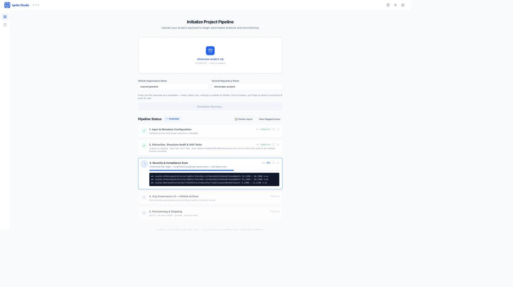
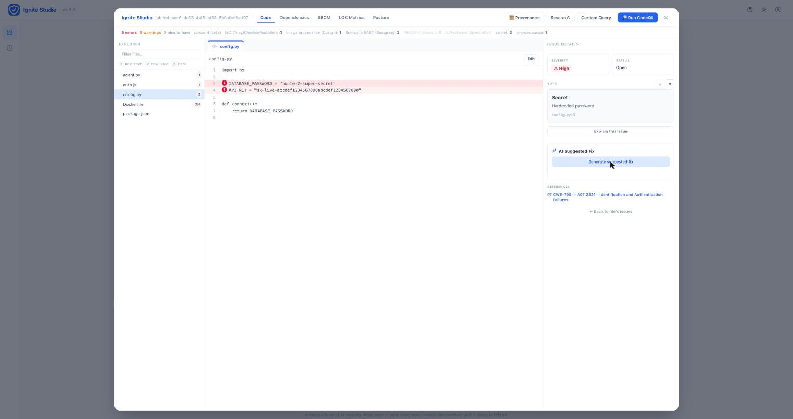
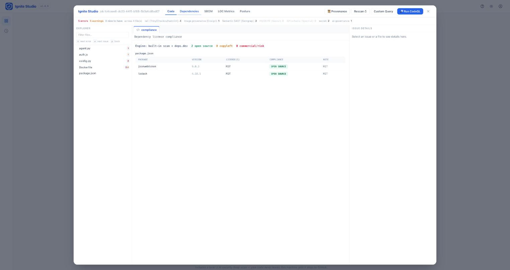
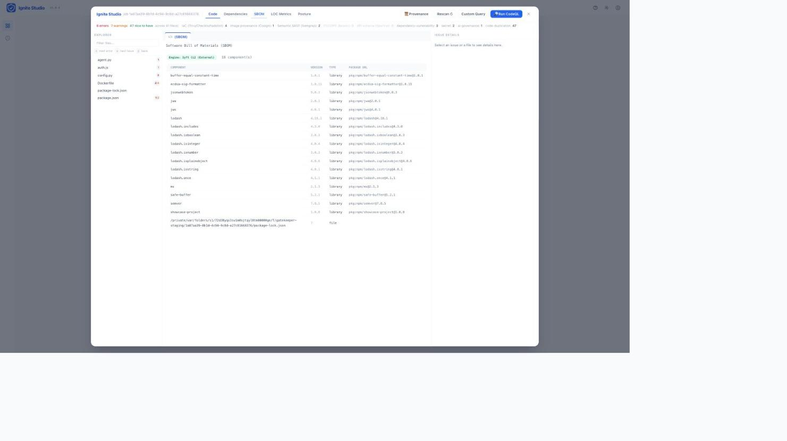
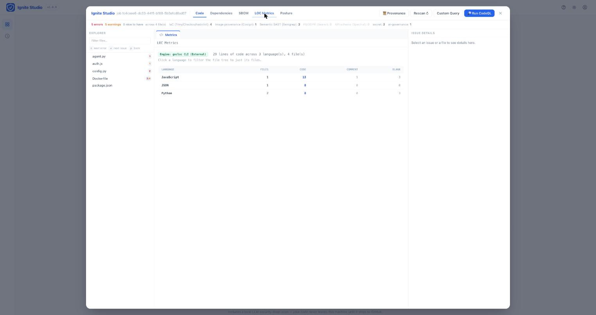
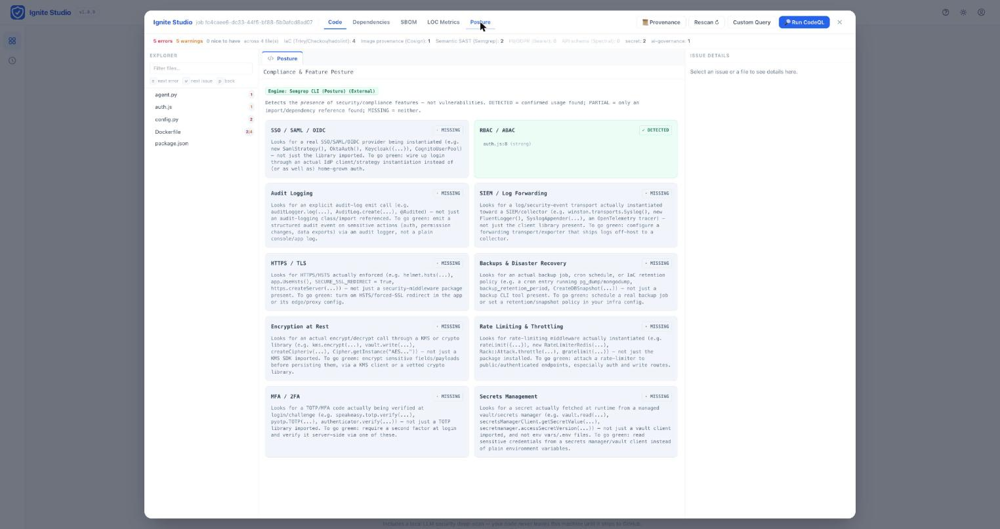
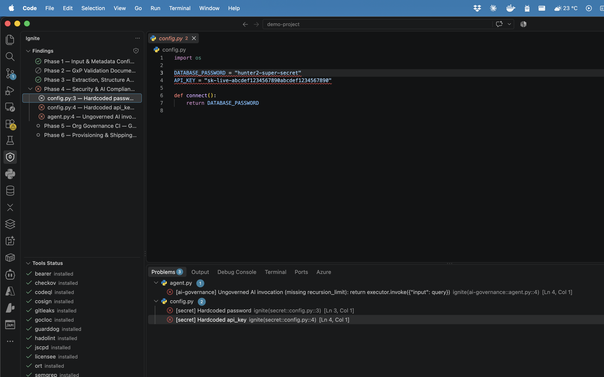
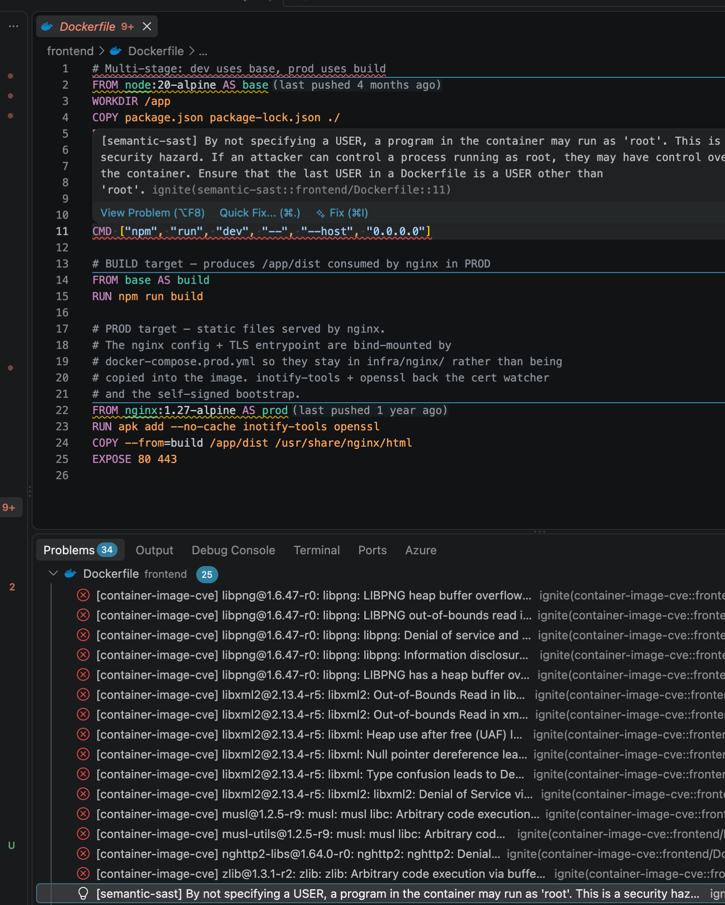

# Ignite

## What

Ignite is a self-hosted compliance gate for code entering a GitHub org.
Point it at a project - a ZIP, a folder, a `git push`, or a call from an
MCP-connected coding agent - and it runs that project through a battery of
deterministic, purpose-built static analysis tools - a real SAST engine
(Semgrep), CVE/GHSA lookups (deps.dev), IaC/container scanners (Trivy,
Checkov, hadolint), a supply-chain malicious-dependency scanner (GuardDog),
secret scanning (regex + gitleaks), image signature verification (cosign),
PII data-flow tracing (Bearer), API schema linting (Spectral), and your
org's own governance CI (`act`) - entirely on your machine. A local LLM
adds one *additional*, optional layer for logic-level review; it is not
what does the SAST or CVE detection above.

**Nothing gets provisioned or pushed to GitHub until every check passes -
or every blocking issue is explicitly justified and overridden**, with that
justification attributed, emailed, and logged to an audit trail. That's the
whole mechanism: one gate, the same standard, regardless of whether a human
clicked upload or an agent called an API.

> **Not "just an LLM wrapper."** Most of the checks above are static
> analysis by dedicated tools with no model in the loop at all - the same
> category of tool a dedicated SAST/SCA platform runs, wired into one
> pipeline with a single review gate. The LLM deep-scan (off-able
> independently via `LLM_DEEP_SCAN_ENABLED`) is a supplementary pass for
> the kind of logic-level reasoning pattern-matching can't do, not a
> replacement for the static engines.

## Why

AI just gave everyone - and everything - the ability to ship an app. It
didn't give everyone the ability to secure one.

Product managers, analysts, and non-engineers across your org can now build
real, working applications with an AI assistant - no CS background, no
security training, no idea what a hardcoded secret or an unbounded LLM call
costs downstream. Coding agents can go further: given a task and a `git
push`, they'll happily commit whatever gets the task done, with no concept
of "should this actually ship" unless something external stops them. Either
way, that code is already reaching your GitHub org.

The volume is the actual problem, on both fronts. Your AppSec team can
review a handful of PRs a week with real scrutiny. It cannot review the
avalanche of AI-generated projects that non-engineers can now produce on
their own, and it cannot sit in the loop for every commit an autonomous
agent makes either - the review bottleneck didn't scale when the
code-generation bottleneck disappeared, for people or for agents.

Ignite is the review layer for that gap: a gate that runs the scrutiny your
team can't scale to - automatically, on every project, before anything
reaches your org's GitHub - whether or not whoever (or whatever) wrote the
code knew to ask for it.

## How

Ignite meets people and agents where they already work, but every path
funnels through the same deterministic checks and the same review gate -
there's no "lighter" mode for one audience:

- **For humans:** drag a ZIP or folder onto the web app and watch phases
  stream live (below); install the [pre-push git hook](#pre-push-hook) so
  `git push` is gated with no separate upload step; or run the
  [VS Code extension](#5-or-scan-straight-from-vs-code---no-upload-no-browser)
  for Problems-panel diagnostics right in the editor.
- **For agents:** call the same checks as [MCP tools](#mcp-server) -
  `check_guidelines`, `check_project`, `onboard_project` - from Claude Code,
  Claude Desktop, or any MCP client, or hit the REST API
  (`/api/pipeline/validate-all`, `/api/pipeline/onboard`) directly with a
  `dryRun` flag. An agent can check its own output *before* ever
  committing, read back exactly which findings are blocking, and either fix
  the source or submit a justified override - the identical
  justify-and-attribute flow a human uses at the web UI's review gate, just
  called as a tool.

Either way, a blocking finding needs a source fix or an attributed,
justified override before anything ships - so accountability doesn't
evaporate just because the thing that wrote the code, or the thing that
onboarded it, wasn't a person.

[View the full technical README on GitHub »](https://github.com/nunomcpereira/ignite#readme)

## Walkthrough

### 1. Upload a project - checks run locally, streamed live

Drop a ZIP or a folder onto the app, name the target org/repo, and hit
**Initiate Onboarding Pipeline**. Every phase - structure audit, secret
scan, license compliance, AI-governance, IaC/supply-chain/SAST scanning,
your org's governance CI - streams its log output live as it runs. Nothing
leaves the machine until the run passes.



### 2. Nothing ships until every finding is reviewed

Before anything is provisioned or pushed, Ignite pauses at a final review
gate listing every flagged issue - blocking and advisory - with the exact
code snippet behind each one. A blocking issue needs a justified override
(logged to an audit trail and emailed) or a source fix before the run can
continue.


### 3. Ignite Studio - AI-assisted triage, in place

Every finding is addressable in **Ignite Studio**: browse the staged file
tree, jump straight to the flagged line, and ask the AI to explain the issue
in plain language or suggest a concrete fix for that exact snippet -
independent of whether the automated LLM deep-scan itself is enabled for
that run.



### 4. Studio's other views - dependencies, SBOM, LOC, posture

Ignite Studio's top bar has one button per connected tool's non-issue
output, each recomputed live against the still-staged project:

**📦 Dependencies** - every manifest dependency's real license, resolved via
ORT (or the built-in parser + deps.dev fallback) and classified
green/amber/red, grouped by manifest file.



**📄 SBOM** - a CycloneDX-style component inventory generated by Syft,
attached as a downloadable project document.



**📊 LOC Metrics** - per-language line/file counts via gocloc; click a
language to filter the file tree to just its files.



**🛡️ Posture** - the Compliance & Feature Posture Engine's DETECTED/PARTIAL/MISSING
grid across eight security/compliance categories (SSO, RBAC, audit logging,
TLS, backups, encryption at rest, rate limiting, secrets management) - a
MISSING card explains exactly what the check looks for and what to add to
turn it green.



### 5. Or scan straight from VS Code - no upload, no browser

For people who don't want the web UI, the [VS Code extension](https://github.com/nunomcpereira/ignite/tree/main/vscode-extension) runs the same `validate-all` pipeline against whatever folder you have open, natively in the editor. It's a thin client - all scanning still happens on a locally running Ignite server - but findings land as real Problems-panel diagnostics with squiggles at the exact line, plus a Findings tree broken down by phase and a Tools Status tree showing which of the optional external scanners are actually installed.



Run **Ignite: Scan Workspace** from the Command Palette; a blocking finding also shows up as an inline diagnostic right where it happened, so there's no context-switch to a browser to see what broke.



**Ignite: Install Pre-Push Hook** wires the same [pre-push hook](#pre-push-hook) into the open repo's git hooks from inside the editor, and **Ignite: Open Review File** opens `.ignite/acknowledgments.md` for filling in `Acknowledge:` justifications on blocking findings - the identical override flow the terminal-based hook uses, just without leaving VS Code. Works with VS Code, Cursor, or VS Code Insiders; full install/settings reference in the [extension's own README](https://github.com/nunomcpereira/ignite/tree/main/vscode-extension#readme).

## What gets checked

Six phases and twelve+ optional external-tool integrations (all soft
dependencies - Ignite works without any of them installed, falling back to
a built-in check where one exists). Most of this list is **static analysis
by a dedicated tool, no LLM involved**:

- Hardcoded secrets & credential leakage - regex scan + gitleaks (static)
- Known-CVE dependencies - deps.dev/OSV lookups against resolved versions (static, deterministic - not a guess)
- Newly-published, not-yet-disclosed malicious dependencies - GuardDog's supply-chain heuristics (static)
- Dependency license risk (commercial/copyleft) - ORT/licensee + deps.dev (static)
- Semantic vulnerabilities - Semgrep's `p/security-audit` SAST ruleset (static, real SAST - not the LLM)
- IaC/container misconfiguration & supply-chain image provenance - Trivy, Checkov, hadolint, cosign (static)
- PII/GDPR data-flow exposure - Bearer's source-to-sink tracing (static)
- Missing security/compliance posture (SSO, RBAC, audit logging, rate limiting, ...) - Semgrep-backed pattern matching (static)
- Your org's own governance CI, run locally via `act` before it ever reaches a real PR (static, runs your actual workflows)
- Ungoverned AI/LangChain invocations - regex/AST check (static)

The **one** LLM-driven check is the local deep-scan pass: injection, path
traversal, SSRF, insecure deserialization, XSS, weak crypto, and similar
logic-level flaws that a fixed rule set can miss. It's independently
toggleable (`LLM_DEEP_SCAN_ENABLED`) - everything above it in this list
keeps running exactly the same with it off.

Every check exists to stop a specific class of real-world incident, not just
to produce a finding for its own sake. The table below maps each threat to
the tool/check combination that catches it - and, since every external tool
is a soft dependency, exactly which tool actually intervenes *if it's
installed* (Ignite still runs, and falls back where it can, if it isn't).

| Threat / attack class | How Ignite catches it | Tool(s) / check | If the tool isn't available |
|---|---|---|---|
| Committed raw `.env`/`.env.*` files leaking live credentials into repo history | Denies any `.env`/`.env.*` file anywhere in the tree (unless already `.gitignore`d) before anything else runs | Built-in structure audit | N/A - built-in, no external tool involved |
| Hardcoded secrets in source (API keys, passwords, tokens, private keys) | Regex scan over every text file; gitleaks runs as a supplemental pass over the same tree when enabled, merged and deduped against the regex hits | Built-in regex scan + gitleaks (optional) | The built-in regex scan always runs regardless; only gitleaks's supplemental pass is skipped |
| Runaway/uncontrolled AI agent loops - unbounded LangChain/LangGraph `.invoke()`/`.stream()` calls (cost blowup, infinite loops, larger prompt-injection blast radius) | Flags any `.invoke(`/`.stream(`/`.ainvoke(`/`.astream(` call missing `recursion_limit` | Built-in AI-governance regex check | N/A - built-in, no external tool involved |
| **SQL injection** - unparameterized/string-concatenated queries, tainted input reaching a raw query or ORM `.raw()`/`.exec()` call | Two independent passes: (1) Semgrep's `p/security-audit` ruleset ships dedicated SQL-injection rules per language/framework (Node `pg`/`mysql`/Sequelize, Python `psycopg2`/Django ORM `.raw()`, Java JDBC/JPA, PHP PDO, Ruby ActiveRecord, ...) flagging a query built by concatenating/interpolating unsanitized input instead of bound parameters; (2) the local LLM deep-scan is explicitly prompted to read the data flow and flag SQL injection it finds, including patterns with no rule yet | Semgrep + LLM deep-scan (security pass) | Semgrep: skipped entirely if missing - no built-in fallback, but the LLM pass still covers this independently. LLM: skipped with a warning if the endpoint is unreachable - Semgrep's rules still catch it on their own |
| Command injection, template injection, path traversal, SSRF, insecure deserialization, XSS, broken auth/authz, weak crypto, unsafe `eval`/`exec`, prototype pollution, insecure temp files, missing input validation | Same two independent passes as SQL injection above, same reasoning | LLM deep-scan (security pass) + Semgrep | LLM pass: skipped with a warning if the endpoint is unreachable. Semgrep: skipped entirely if missing - no built-in fallback for a rule engine, but the LLM pass still covers this ground independently |
| Dependency with a **known**, already-disclosed CVE/GHSA advisory | Resolves each manifest dependency's real version and cross-references deps.dev's aggregated OSV/GHSA data | Built-in scanner + deps.dev API | Not tied to a locally-installed tool - that specific lookup just fails soft (marked unresolved, not blocking) if deps.dev is unreachable |
| Dependency that is **malicious but has no advisory yet** - install-script exfiltration, obfuscated/encoded payloads, silent network calls, typosquatting | Downloads and statically inspects each npm/PyPI dependency's actual package contents against Semgrep-based supply-chain-attack heuristics | GuardDog (on by default if installed) | Check skipped entirely - no fallback (this heuristic can't be meaningfully approximated) |
| Commercial/proprietary/unrecognized dependency licenses creating unreviewed IP/legal exposure; the project's own license terms | Resolves real per-dependency licenses (ORT, or the built-in manifest parser + deps.dev fallback) and classifies green/amber/red; scans every `LICENSE`/`LICENCE` file for commercial/proprietary language | ORT / licensee / deps.dev | Falls back to the built-in manifest parser + deps.dev lookup if ORT is missing; the project's-own-license row is simply omitted if licensee is missing |
| IaC/container misconfiguration - privileged containers, missing resource limits, insecure Terraform/Kubernetes/Helm settings, unpinned base images, missing `USER` | Trivy's config scanner is primary, supplemented by Checkov's larger policy set and hadolint's Dockerfile-only rules, deduped by file/line/rule-id; falls back to a built-in unpinned-tag/missing-`USER` heuristic when none are installed | Trivy + Checkov + hadolint | Falls back to a built-in Dockerfile heuristic if Trivy is missing; Checkov/hadolint just stop supplementing (fewer findings, same baseline coverage) if they're missing |
| Supply-chain base-image tampering - a Dockerfile `FROM` image with no verifiable provenance | Verifies Sigstore/cosign keyless signatures on every unique base image referenced; unsigned images are flagged (advisory) | cosign | Check skipped entirely - no fallback (signatures can't be verified without the tool) |
| Logical/semantic vulnerabilities beyond single-line pattern matching | Semgrep's registry rulesets (`p/security-audit` by default) | Semgrep | Check skipped entirely - no fallback |
| PII/GDPR data-flow exposure - personal data (request params, user objects) reaching logs, DB writes, or third-party calls without controls | Traces data flow from source to sink, filtered to Bearer's own PII/Personal-Data-tagged findings only | Bearer | Check skipped entirely - no fallback |
| Copy-pasted vulnerable/stale logic drifting out of sync across a codebase | Flags duplicated code blocks above a configurable threshold (advisory) | jscpd (off by default) | Check skipped entirely - no fallback (off by default regardless) |
| Insecure API design/contract violations in OpenAPI/AsyncAPI schemas | Lints every discovered schema file (found by content, not filename) against org REST/AsyncAPI conventions | Spectral | Check skipped entirely - no fallback |
| Missing security/compliance controls that widen the attack surface even with no single vulnerable line - no SSO/MFA, no RBAC, no audit logging, no rate limiting, secrets read from plain env vars instead of a vault, etc. | Classifies *presence* (not vulnerabilities) of eight security/compliance categories as DETECTED/PARTIAL/MISSING via a dedicated Semgrep ruleset; built-in regex fallback when Semgrep is unavailable | Compliance & Feature Posture Engine (reuses Semgrep) | Falls back to a built-in regex posture scanner (same weak/strong model, narrower coverage) if Semgrep is missing |
| Org-mandated security/compliance CI gates silently not enforced locally, only caught after a real PR | Runs the actual central `ai-guardrails-orchestrator.yml` (and every workflow it `uses:`) locally via `act`, so local pass/fail matches the real remote gate | act + Docker | Soft-skipped with a warning if `act`/Docker are missing - the workflows still gate remotely on GitHub, just not caught locally before pushing |
| Unauthorized/unvetted code reaching the org's GitHub regardless of findings above | Provisioning + push only happens after every enabled phase passes (or every blocking issue is overridden with a justified, attributed, emailed audit record) | The pipeline gate itself | N/A - enforced by the pipeline's own logic, not an external tool |
| Zip-slip - a malicious archive entry resolving outside the staging directory | Every archive entry's resolved path is verified to stay inside the staging root before extraction; symlink entries are skipped entirely | Built-in extraction guard | N/A - built-in, no external tool involved |
| Zip-bomb / disk-exhaustion DoS via a malicious or oversized upload | Extracted size capped at 1 GB, upload capped at 250 MB | Built-in size guards | N/A - built-in, no external tool involved |
| Command injection via org/repo names or shelled-out tool arguments | Every `git`/`gh`/tool invocation uses `execFile` with argument arrays (no shell); org/repo names validated against GitHub's naming rules; commands restricted to a fixed allowlist | Built-in sanitizers | N/A - built-in, no external tool involved |
| The project's own automated test suite silently regressing | Auto-detects Node/Go/Rust/Python/Java and runs that ecosystem's native test runner (`npm test`, `go test`, `cargo test`, `pytest`, `mvn test`) inside an isolated Docker container | Built-in detection + Docker | Skipped if no recognized test setup is found, or if Docker isn't available - logged, never silently assumed to pass |
| A repo drifting out of compliance *after* onboarding - a new vulnerable/malicious dependency merged later, with no one notified | Effectivated repos can opt into a scheduled (daily/weekly/monthly) re-check of the default branch; on failure, emails the repo's CODEOWNERS contact or files a GitHub issue if none can be resolved | Scheduled re-check + CODEOWNERS check | N/A for the schedule/notify logic itself - the re-check still depends on whichever Phase 4 tools are installed on the server at the time it runs |
| A `CODEOWNERS`-less repo silently having no one accountable for findings | Advisory check for a `CODEOWNERS` file and any email-address owner listed in it | Built-in CODEOWNERS check | N/A - built-in, no external tool involved |

Full details, install instructions, and the on/off default for every tool: see the [README's tool table](https://github.com/nunomcpereira/ignite#external-tools).

## Also an MCP server - bring these checks into your editor
{: #mcp-server }

Beyond the web app, Ignite ships an [MCP](https://modelcontextprotocol.io)
server (`mcp-server.js`) exposing the same guideline/security checks as
tools an AI coding agent can call *during development* - not just at
onboarding time. Point Claude Code, Claude Desktop, or any other MCP client
at it (stdio, or Streamable HTTP - auto-started alongside `npm start` on
`:51338/mcp`) to get:

- `check_guidelines` / `check_project` - run the same regex/AST guideline checks against a snippet or a whole project directory, live, as you write code.
- `check_dependency_licenses` / `check_dependency_vulnerabilities` - the same license-compliance and CVE/GHSA scans Phase 3 runs automatically, on demand.
- `onboard_project` - trigger a full (or `dryRun`) pipeline run against a running Ignite server, so an agent can "see what would fail" before ever pushing.

This means an agent working on your codebase can catch a hardcoded secret,
an ungoverned AI call, or a risky dependency *before* it's ever committed -
the same gate that blocks onboarding, available as a tool call mid-session.

**Acknowledging findings via MCP.** `onboard_project` already accepts
`overrides: [{issueId, justification}]` and `actor: {email, name}`, and a
failed run's response carries the exact unresolved `issues` (id, category,
severity, summary, file, line) needed to build them - the same shape the
[pre-push hook's CLI acknowledgment](#pre-push-hook) works from. An agent
can call `onboard_project`, read back which findings are still blocking,
call it again with justified overrides for the ones it (or you, via the
agent) decides to accept, and only what's genuinely unresolved keeps
blocking - no browser involved at any point.

See [MCP server](https://github.com/nunomcpereira/ignite#mcp-server) in the README for setup.

## How to start it

**Prerequisites:**

- **Node.js ≥ 22**
- **git** on `PATH`
- **A way to authenticate to GitHub** - `gh` CLI is the easy path:
  ```bash
  gh auth login
  gh auth status   # must show a logged-in account with repo-create permission
  ```
  but it's a soft dependency, not a hard one - see below.

**Run it:**

```bash
git clone https://github.com/nunomcpereira/ignite.git
cd ignite
npm install
npm start
# → http://localhost:51337
```

That's it - open `http://localhost:51337`, drop a ZIP or folder onto the drop
zone, and run the pipeline. Every external tool (Trivy, Semgrep, gitleaks,
GuardDog, ...) is an optional soft dependency - Ignite works out of the box
with none of them installed, falling back to a built-in check where one
exists. The local LLM deep-scan needs a llama.cpp-compatible endpoint at
`LLM_SCAN_URL` (default `http://localhost:8050`); if it's unreachable, that
one check is skipped with a warning rather than failing the run.

**Want every check actually running, not falling back?** One script
installs all fourteen optional tools (ORT, licensee, gitleaks, Trivy,
Checkov, hadolint, Syft, cosign, Semgrep, Bearer, GuardDog, jscpd, gocloc,
Spectral) plus `act`, instead of copy-pasting `brew`/`npm`/`pip`/`gem`
commands one at a time:

```bash
curl -fsSL https://raw.githubusercontent.com/nunomcpereira/ignite/main/scripts/install-tools.sh | bash
```

Idempotent - safe to re-run any time, it only installs what's still
missing. macOS (Homebrew) is the primary target, matching every install
command in the README exactly; skip an individual tool with
`INSTALL_<TOOL>=false` (e.g. `INSTALL_GUARDDOG=false`). Docker itself isn't
installed for you (it needs its GUI installer) - the script just flags it
if missing, since Phase 5 and the multi-language unit-test runner both
depend on it.

> **Security note:** this server executes `git`/`gh` with the host
> machine's credentials. Run it locally or behind authentication - never
> expose it unauthenticated to a network.

**Pushing over HTTPS (gh) or SSH:** by default Phase 6 pushes over
`https://github.com/...`, authenticated through `gh auth git-credential`
using the connected account's token. Set `GITHUB_REMOTE_PROTOCOL=ssh` to
push over `git@github.com:...` instead, authenticated by whatever SSH
key/agent is already configured for `github.com` on this machine - no git
credential helper involved. Either way, repo creation/auto-merge/ref
creation still go through the GitHub API - SSH replaces the **push
transport**, not API auth, so a GitHub token is required in both modes.

**Don't want `gh` installed at all?** Every plain GitHub API call (repo
creation, PR open/auto-merge/checks, issue filing, cloning) is a soft
dependency, same pattern as the scanning tools: Ignite probes for `gh`
once and transparently falls back to calling the GitHub REST/GraphQL API
directly over HTTPS with a token when it's missing. Per-onboarding-request
calls already have a token via the connected account, no extra config
needed. Server-level calls with no per-request user - fetching the
governance workflow, cloning/filing issues for a scheduled re-check - need
`GH_TOKEN` or `GITHUB_TOKEN` set to a personal access token instead.
Combine with `GITHUB_REMOTE_PROTOCOL=ssh` for a host with no `gh` binary at
all.

## Pre-push hook - check before you push, not after
{: #pre-push-hook }

Uploading a ZIP to a web app is an extra step most people would rather
skip. Ignite's `validate-all` endpoint takes a local `projectPath` and runs
phases 1–5 synchronously - no upload, no UI - which is exactly what a git
`pre-push` hook needs. A ready-to-use one ships in the repo:

**[⬇ Download `hooks/pre-push`](https://raw.githubusercontent.com/nunomcpereira/ignite/main/hooks/pre-push)**

Install it into any repo:

```bash
# One repo:
curl -o .git/hooks/pre-push https://raw.githubusercontent.com/nunomcpereira/ignite/main/hooks/pre-push
chmod +x .git/hooks/pre-push

# Every repo on this machine, instead of copy-pasting into each one
# (.git/hooks/ isn't itself tracked by git, so a shared dir is the way to
# cover every repo at once):
mkdir -p ~/.git-hooks
curl -o ~/.git-hooks/pre-push https://raw.githubusercontent.com/nunomcpereira/ignite/main/hooks/pre-push
chmod +x ~/.git-hooks/pre-push
git config --global core.hooksPath ~/.git-hooks
```

It needs a running Ignite server reachable at `IGNITE_BASE_URL` (default
`http://localhost:51337`) and `node` on `PATH`. On `git push`, it posts the
repo's absolute path to `/api/pipeline/validate-all`, blocks the push if any
check fails, and prints the failing phase's logs so you don't have to open
the UI just to see what broke:

```bash
$ git push
→ Running Ignite checks against /Users/you/projects/some-repo ...
✗ Ignite checks failed - push blocked.
  Phase 4 - Security & AI Compliance Scan
    ✗ python/config.py:3 - Hardcoded password

✗ 1 blocking finding(s) need a justification or a source fix.
  Edit /Users/you/projects/some-repo/.ignite/acknowledgments.md, fill in "Acknowledge:"
  for whichever you want to override, then push again - or fix them in the
  source instead.
```

**Acknowledge findings from the terminal - no browser needed.** A blocking
finding isn't a dead end: the hook writes `.ignite/acknowledgments.md` at the repo
root, one entry per finding, each with a blank `Acknowledge:` line. Every run
also drops a point-in-time snapshot of every finding at
`.ignite/scans/<timestamp>/findings.md`:

```
ID: secret::python/config.py::3
# [ERROR] secret - Hardcoded password
#   python/config.py:3
Acknowledge:
```

Fill in a justification, save, `git push` again - the hook resubmits every
filled-in line as a real, attributed override (using your `git config
user.name`/`user.email`), the same justify-and-override step the web UI's
review gate does, just from your own editor. Only whatever's still
unresolved remains in the file afterward, and it's a durable local ledger,
not a one-shot prompt: an id you've already justified stays overridden on
every future push until the line it's attached to changes.

Fast by default - `runLocalCi` is off (skips Phase 5's `act`/Docker
governance CI, which is slow and typically belongs in real CI, not on
every push) and only blocking errors gate the push, not warnings. Both are
configurable via env vars documented at the top of the script
(`IGNITE_RUN_LOCAL_CI`, `IGNITE_WARNING_MODE`), along with a one-push
`IGNITE_PREPUSH_SKIP=true` escape hatch that's logged rather than silent
like `git push --no-verify`.

Full setup, every environment variable, tool-by-tool install instructions,
and the REST/MCP API reference: [github.com/nunomcpereira/ignite](https://github.com/nunomcpereira/ignite).
